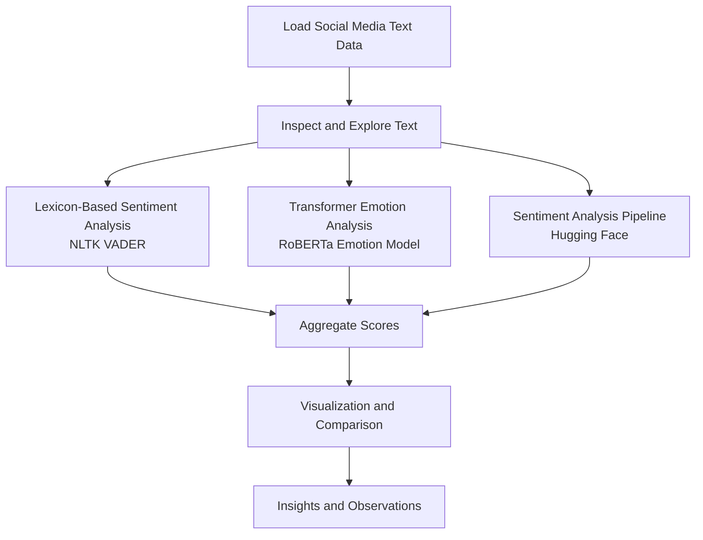

# Social Media and Mental Health  
An in-depth analysis of stress and mental health using social media comments (Reddit) using Natural Language Processing (NLP).

## Summary
People often express emotional pressure, anxiety, and distress online. Sometimes openly, sometimes indirectly. This project aims to analyze text data from social media comments (Reddit) and build machine learning models that can identify stress-related language patterns.

## Objective
- Understanding, cleaning and preparing the dataset
- Analyzing the text to identify stress-related language.
- Apply natural language processing techniques to the real-world data.
- Apply lexicon-based and pretrained transformer models to text data.
- Compare sentiment and emotion outputs across different approaches.
- Understand how language patterns reflect mental health discussions.

**Note:** This project is **not** meant for diagnosis or clinical use.  
It focuses on learning patterns from data and understanding how language reflects mental states.

## Dataset
This project uses the **Dreaddit dataset**, a collection of Reddit posts labeled as stressful or non-stressful.

- Source: Dreaddit (Reddit-based mental health dataset)
- Data type: Short-form user-generated text
- Content focus:
  - Emotional expression
  - Stress indicators
  - Sentiment polarity

The dataset is used directly for analysis without supervised model training.

**Acknowledgements:**
1. https://www.kaggle.com/datasets/ruchi798/stress-analysis-in-social-media
2. Turcan, E., & McKeown, K. (2019). Dreaddit: A Reddit dataset for stress analysis in social media. arXiv preprint arXiv:1911.00133.

## Technologies Used

- Python
- Pandas and NumPy for data processing
- SciPy for helper math (softmax)
- Matplotlib and Seaborn for visualization
- NLTK (VADER) for lexicon-based sentiment scoring
- Hugging Face Transformers for pretrained NLP models
- vaderSentiment (NLTK SentimentIntensityAnalyzer), cardiffnlp/twitter-roberta-base-emotion, transformers sentiment-analysis pipeline (default)
- VS Code

## Project Structure and Flow

## Key Challenges

- Emotional nuance is difficult to capture with simple sentiment scores
- Different models sometimes disagree on emotional interpretation
- Social media language includes sarcasm, exaggeration, and ambiguity
- Pretrained models may reflect biases from their training data

## Key Takeaways

- Emotional signals are present but interpreted differently by each model
- Lexicon-based methods are fast but limited in depth
- Transformer models capture richer emotional context
- Model outputs should be treated as signals, not facts
- Mental health text analysis requires caution and humility

## Limitations

- No supervised training or ground-truth labels
- Results depend entirely on pretrained model behavior
- Cultural and linguistic context is not fully captured
- Not suitable for clinical or diagnostic use

## Future Improvements

- Add explicit stress or mental health labels for evaluation
- Compare additional emotion and sentiment models
- Perform error analysis on conflicting predictions
- Extend analysis to larger and more diverse datasets

## Author

**Tanweer Ashif**  
AI/ML Software Engineer